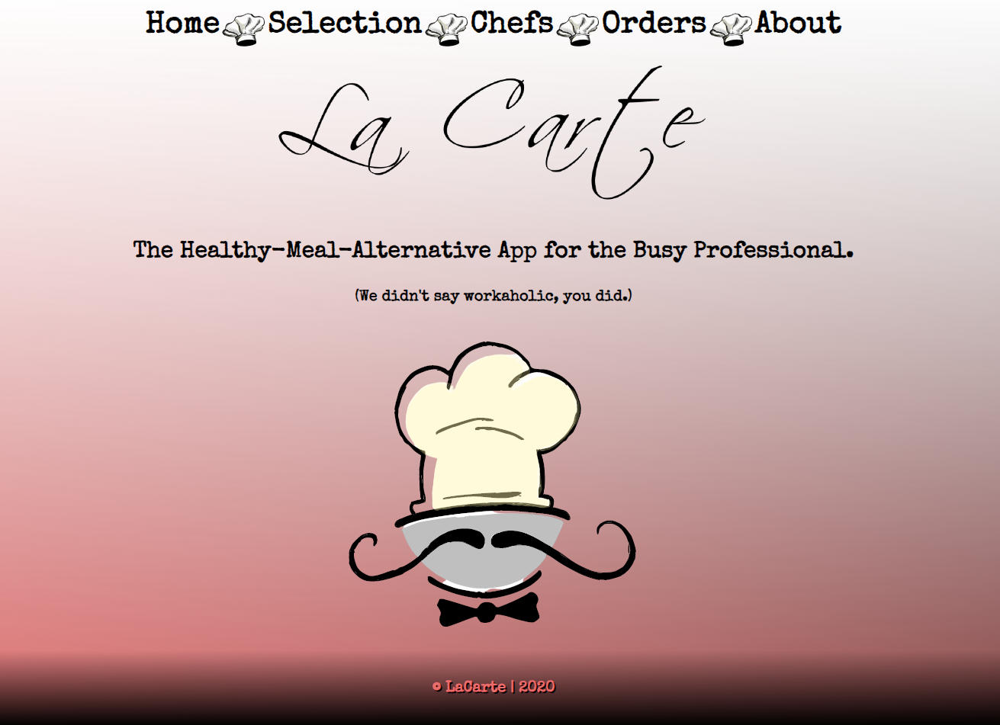
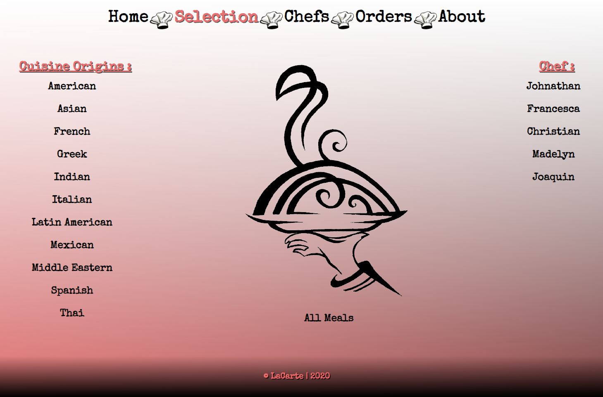
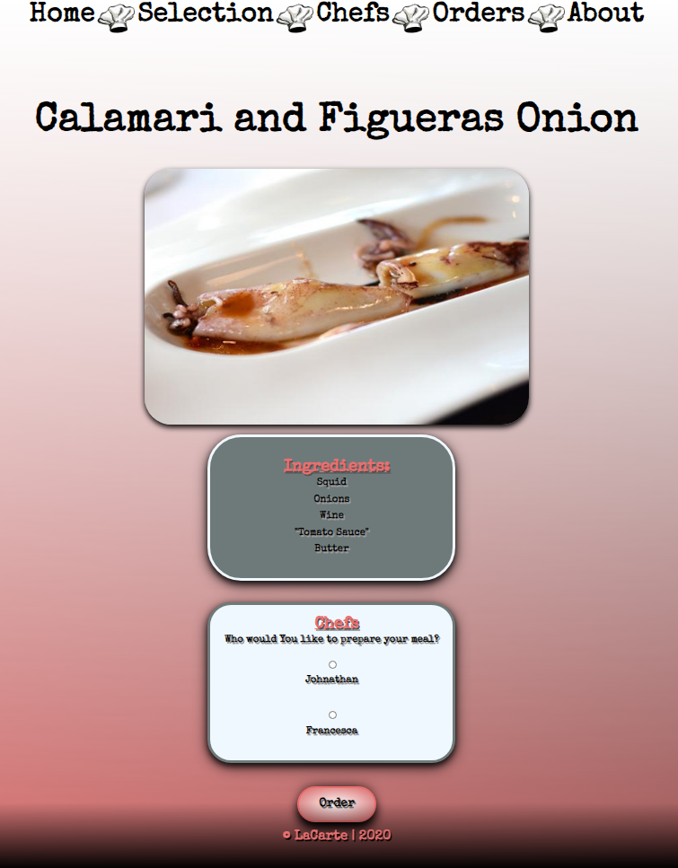
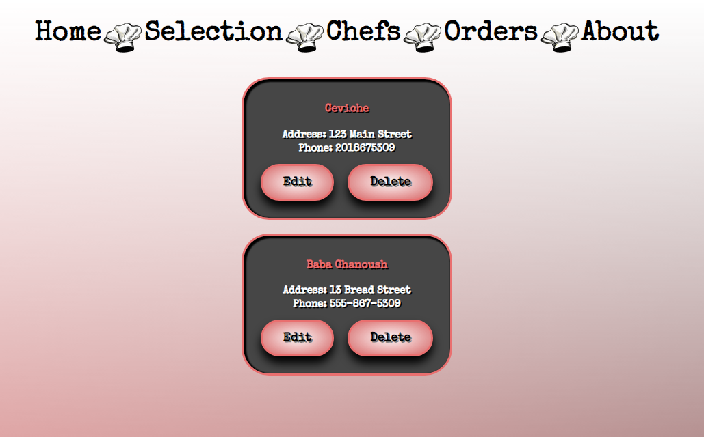

# La Carte

The Healthy-Meal-Alternative App for the Busy Professional.
       (We didn't say workaholic, you did.)

## [La Carte](https://la-carte.lfuen.vercel.app/)

La Carte is a healthy meal-ordering app, catered figuratively and quite *literally* to the ever-working individual.

You can browse meals from different areas of the world and even choose which chef you would like to personalize your meal!

The Orders page will keep track of your past orders and even let you update an order that's already been placed.
 

 

This is the client side of the application which uses React as it's front end. Context is being used throughout the application in order to manage state.
 Knex is what is connecting my server and my client together. I have incorporated smoke testing and snapshot testing inside of my client application.

 

This is a fullstack app using Heroku for server hosting and Vercel for client hosting.

[Heroku](https://heroku.com) 

[Vercel](https://vercel.com) 

Below is the link to the API Repository for La Carte.
 

[API](https://github.com/LFuen/laCarte-API)

This project was bootstrapped with [Create React App](https://github.com/facebook/create-react-app).

